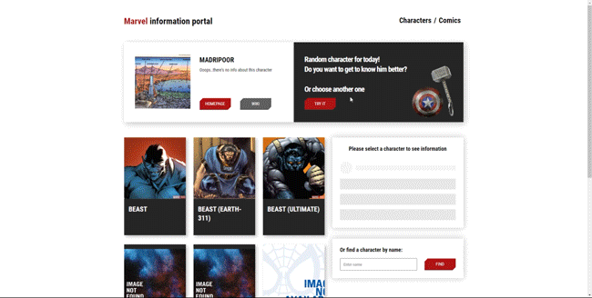

# Marvel's heroes catalog
A React application that uses [the official API from Marvel](https://developer.marvel.com/) in its work. The application allows you to get information about any character from the Marvel database, including a list of comics in which this character appears.

## Getting started
You can view a live demo over at https://xartv.github.io/marvel-test-project/  
Desktop only (adaptation for mobile devices ___in progress___)

To run the project locally:
* Clone this repo `git clone https://github.com/xartv/marvel-test-project.git`
* Run `cd marvel-test-project` to go to the directory 
* Run `npm install` to install all required dependencies
* Run `npm start` to start the local server (this project uses [create-react-app](https://create-react-app.dev/))

## Functionality overview
* Getting characters and comics from the official Marvel database
* Search for a specific character by name
* View basic information on each character and comic
* Showing a random character

